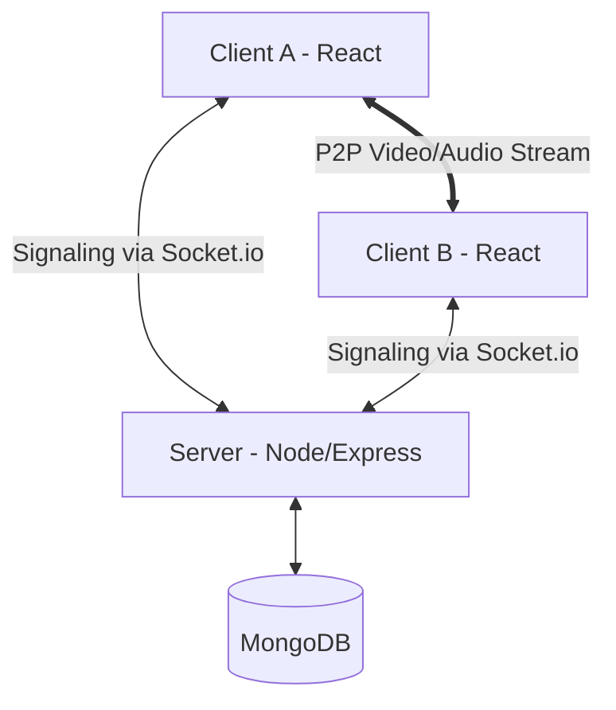

# Video Conferencing Web Application

A full-stack, real-time video conferencing application built using the MERN stack and WebRTC. This platform allows users to host and join video meetings with real-time chat functionality, secure authentication, and a sleek user interface.

## 🚀 Features

- **Real-time Video/Audio**: High-quality peer-to-peer video and audio communication powered by WebRTC.
- **Instant Messaging**: Real-time chat functionality during meetings using Socket.io.
- **Secure Authentication**: User registration and login system with encrypted password storage.
- **Meeting History**: Keep track of your past meetings and connections.
- **Responsive Design**: Modern and clean UI built with Material UI, fully responsive for all device sizes.
- **Dynamic Meeting Rooms**: Create unique meeting IDs or join existing ones instantly.

## 🛠️ Tech Stack

**Frontend:**
- **React.js**: Library for building the user interface.
- **Material UI (MUI)**: For professional components and styling.
- **Socket.io-client**: For real-time signaling.
- **WebRTC**: For peer-to-peer video/audio streaming.
- **React Router**: For seamless navigation.

**Backend:**
- **Node.js**: JavaScript runtime environment.
- **Express.js**: Web framework for Node.js.
- **MongoDB**: NoSQL database for storing user data and meeting history.
- **Socket.io**: For handling real-time events and signaling.
- **Mongoose**: ODM for MongoDB.

## 🏗️ Project Architecture

The application follows a client-server architecture with real-time signaling for WebRTC:

1.  **Frontend (React & Material UI)**: 
    - Manages the user interface and application state.
    - Captures local media (audio/video) using `getUserMedia`.
    - Handles WebRTC Peer-to-Peer connections for low-latency streaming.
2.  **Backend (Node.js & Express)**:
    - Provides a RESTful API for user authentication and meeting history management.
    - Integrates Socket.io for real-time signaling (exchange of SDP and ICE candidates).
3.  **Database (MongoDB)**:
    - Stores persistent data such as user profiles and meeting logs.
4.  **Real-time Signaling**:
    - Uses Socket.io as the signaling channel to help peers find each other and establish direct connections.



## 📊 Database Schema (Model Design)

The project uses MongoDB with Mongoose for data modeling. Below are the core schemas:

### 👤 User Model
Stores user account details and references to their meetings.
- `name` (String): Full name of the user.
- `username` (String): Unique identifier for login.
- `password` (String): Hashed password for security.
- `token` (String): Session token for authentication.
- `meetings` (Array): List of previous meeting codes.

### 📅 Meeting Model
Logs information about individual meetings.
- `user_id` (String): Reference to the host/user.
- `meetingCode` (String): Unique code for the meeting room.
- `date` (Date): Timestamp of when the meeting occurred.

## 📂 Project Structure

```text
video-conferencing-app/
├── Backend/
│   ├── controllers/      # Business logic & Socket management
│   ├── models/           # Mongoose schemas
│   ├── routes/           # API endpoints
│   ├── index.js          # Entry point
│   └── .env              # Environment variables
└── frontend/
    ├── public/           # Static assets
    ├── src/
    │   ├── contexts/     # Auth & Socket contexts
    │   ├── pages/        # Main views (Home, VideoMeet, Auth)
    │   ├── utils/        # Helper functions
    │   ├── App.js        # Main routing
    │   └── index.js      # Frontend entry point
```

## 📦 Installation & Setup

1. **Clone the repository:**
   ```bash
    git clone https://github.com/so8-ham/NexMeet.git
   cd video-conferencing-app
   ```

2. **Backend Setup:**
   - Navigate to the backend directory: `cd Backend`
   - Install dependencies: `npm install`
   - Create a `.env` file and add your credentials:
     ```env
     PORT=8000
     MONGO_URI=your_mongodb_connection_string
     ```
   - Start the backend server: `npm run dev`

3. **Frontend Setup:**
   - Navigate to the frontend directory: `cd ../frontend`
   - Install dependencies: `npm install`
   - Start the React development server: `npm start`

## 🛡️ Authentication

The app uses JWT-based authentication to ensure that user data and meeting histories are secure. Passwords are hashed using `bcrypt` before being stored in the database.

## 💬 Real-time Communication

- **Signaling**: Socket.io is used to exchange connection metadata (signals) between peers.
- **Streaming**: Once the signal is established, WebRTC handles the direct peer-to-peer media stream, ensuring low latency.

## 📄 License

This project is licensed under the ISC License.

---

Created with ❤️ by [Sohom Mandal](https://github.com/sohommandal)
